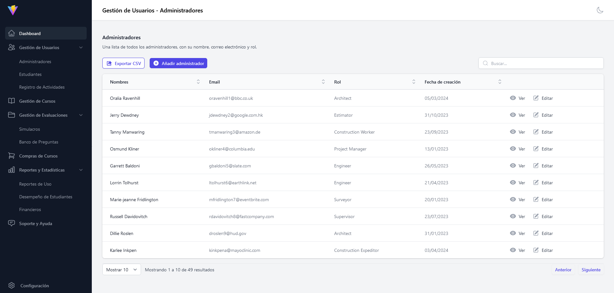
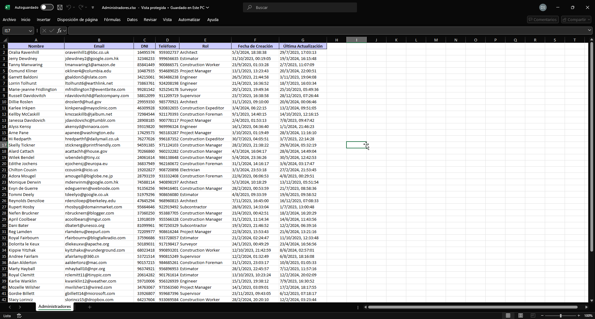

# Aula Virtual - Admin

Este es el proyecto **Aula Virtual Admin**, diseñado como un panel de administración para gestionar la plataforma del aula virtual. Aunque el proyecto ha sido **pausado**, ya se han implementado algunas funcionalidades clave, como el **CRUD** usando `json-server`, la capacidad de **exportar datos a Excel**, y **notificaciones** utilizando **Sonner**.

Puedes acceder a la aplicación en el siguiente enlace:  
[Aula Virtual - Admin Panel](https://aula-virtual-admin-dybsm98.firebaseapp.com/)

## Estado del Proyecto

Actualmente, el desarrollo de este proyecto está **pausado**, pero puede ser retomado en el futuro para continuar con la implementación de nuevas características.

## Funcionalidades Implementadas

- **CRUD Completo**: 
  - Crear, Leer, Actualizar y Eliminar datos, como cursos, convenios, y usuarios.
  - Gestión de datos simulada a través de `json-server` como backend falso.
  
- **Exportación de Datos a Excel**:
  - Función para exportar datos administrados a archivos Excel para análisis y reportes.

- **Formularios con Validación**: 
  - Uso de **React Hook Form** para la gestión eficiente de formularios.
  - Validación de formularios utilizando **Yup** para asegurar que los datos sean correctos antes de ser enviados.

- **Notificaciones**:
  - Implementación de **Sonner** para mostrar notificaciones amigables en la interfaz cuando se crean, actualizan o eliminan datos.

## Tecnologías Utilizadas

- **React**: Para la construcción de la interfaz de usuario.
- **Vite**: Para el desarrollo rápido y eficiente.
- **Tailwind CSS**: Para el diseño y estilo de la interfaz.
- **json-server**: Simulador de backend para manejo de datos CRUD.
- **xlsx**: Librería utilizada para exportar datos a archivos Excel.
- **React Hook Form**: Para la gestión y control de formularios.
- **Yup**: Para la validación de los formularios y datos.
- **Sonner**: Para mostrar notificaciones en la interfaz de usuario.

## Vistas del Proyecto

### Vista de Administradores
Aquí puedes ver la interfaz donde se gestionan los administradores.



### Vista de Exportación a Excel
A continuación, se muestra cómo se ve el archivo Excel.



## Cómo Usar el Proyecto

Aunque el proyecto está pausado, si deseas explorarlo, sigue estos pasos para ejecutarlo localmente:

1. Clona este repositorio:

```bash
git clone https://github.com/Polarsh/aula-virtual-admin.git
```

2. Navega al directorio del proyecto:

```bash
cd aula-virtual-admin
```

3. Instala las dependencias:

```bash
npm install
```

4. Inicia el servidor de desarrollo:

```bash
npm run dev
```

5. Abre `http://localhost:5173` en tu navegador para ver el panel de administración.

6. Para iniciar el `json-server` y simular el backend:

```bash
npm run json
```

## Exportación de Datos a Excel

Una de las funcionalidades clave ya implementadas es la exportación de datos a Excel. Para utilizarla:

1. Selecciona los datos que deseas exportar desde el panel de administración.
2. Haz clic en el botón de **Exportar a Excel**.
3. El archivo Excel con los datos seleccionados se descargará automáticamente.

## Funcionalidades Planeadas (pendientes)

Si el proyecto se retoma en el futuro, estas son algunas de las funcionalidades que se habían planeado:

- **Autenticación de Usuarios**: Sistema de login para los administradores.
- **Filtros Avanzados**: Búsqueda y organización de los datos.
- **Gráficos y Estadísticas**: Visualización de datos clave del aula virtual.

## Dependencias Clave

- **react**: Para la construcción de la interfaz de usuario.
- **tailwindcss**: Para los estilos.
- **json-server**: Para simular un backend durante el desarrollo.
- **xlsx**: Para la exportación de datos a archivos Excel.
- **React Hook Form**: Para la gestión eficiente de formularios.
- **Yup**: Para la validación de los formularios y datos.
- **Sonner**: Para las notificaciones en la interfaz de usuario.
